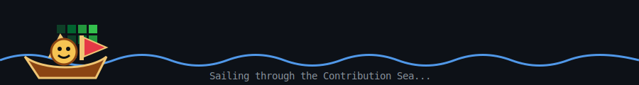

<div align="center">

# ☠️ KHOIIMEN


### 🏴‍☠️ “俺はルフィ！海賊王になる男だ！”

<br/>


</div>

---

<table>
<tr>

<td width="55%">

## ☠️ About Me

Hi, I'm **Nguyen Anh Khoi**, a Frontend Developer currently working at **Hyra Tek**.

Want some advices? text me...**.

### Current Mission

- ⚔️ Building fast, responsive and scalable web apps
- 🎨 Focused on pixel-perfect UI/UX implementation
- 🔗 Experienced with API integration
- 📈 Developing trading dashboards and fintech platforms
- 🧠 Exploring AI-powered applications
- 🌊 Constantly learning and improving

### Current Focus

```txt
React.js
Next.js
TypeScript
TailwindCSS
Node.js
MongoDB
Trading Platforms
AI Products
```

</td>

<td width="45%">

## 🍖 Devil Fruit Skills

| Fruit | Ability |
|--------|----------|
| ⚛️ React React no Mi | Build reusable UI |
| 🎨 Tailwind no Mi | Responsive layouts |
| 🔗 API no Mi | Connect services |
| 🧠 Logic no Mi | Clean architecture |
| 🐛 Debug no Mi | Hunt bugs |
| 🚢 Ship no Mi | Deliver products |

</td>

</tr>
</table>

---

# ⚔️ Tech Stack

### Frontend

<p align="center">


</p>

### Backend & Database

<p align="center">


</p>

### Tools

<p align="center">


</p>

---

# 🚢 Featured Projects

<table>

<tr>

<td width="33%">

### 🛒 MERN E-Commerce

Full-stack e-commerce website with:

- Product Management
- Authentication
- Google OAuth
- Cart System
- Payment Flow

**Stack**

`React`
`Node.js`
`MongoDB`
`Express`

</td>

<td width="33%">

### 📈 Trading Platform

Modern trading interface with:

- Real-time charts
- Pricing Plans
- API Integration
- Responsive Layout

**Stack**

`React`
`TailwindCSS`
`API`
`Recharts`

</td>

<td width="33%">

### 🧠 Health Optimizer

AI-powered platform for:

- Mental Health Tracking
- Study Optimization
- Work Schedule Management

**Stack**

`React`
`AI`
`Chart.js`
`TailwindCSS`

</td>

</tr>

</table>

---

---

---

# 🌊 Contribution Sea

<div align="center">



</div>

<br/>

<p align="center">


</p>

---
# 📊 GitHub Activity

<div align="center">

<table>
<tr>
<td align="center" width="50%">
  
</td>
<td align="center" width="50%">
  
</td>
</tr>
</table>

<br/>


</div>
# 📫 Contact Me

<p align="center">

<a href="mailto:Roynguyen2004@gmail.com">
  
</a>

<a href="https://github.com/Khoii18">
  
</a>

<a href="https://www.facebook.com/Khoiimen">
  
</a>

<a href="https://www.instagram.com/khoiimen/">
  
</a>

</p>

---

<div align="center">

### 🏴‍☠️ Let's Connect Across The Grand Line

<a href="https://www.facebook.com/Khoiimen">
  
</a>

<a href="https://www.instagram.com/khoiimen/">
  
</a>

<a href="https://github.com/Khoii18">
  
</a>

</div>

```js
const khoii18 = {
  role: "Frontend Developer",

  mainStack: [
    "React",
    "TypeScript",
    "TailwindCSS",
    "Node.js",
    "MongoDB"
  ],

  currentFocus: [
    "Trading Platform",
    "AI Product",
    "UI Design",
    "API Integration"
  ],

  goal: "Become a strong product-focused engineer"
};

while (true) {
  learn();
  build();
  debug();
  ship();
}
```
